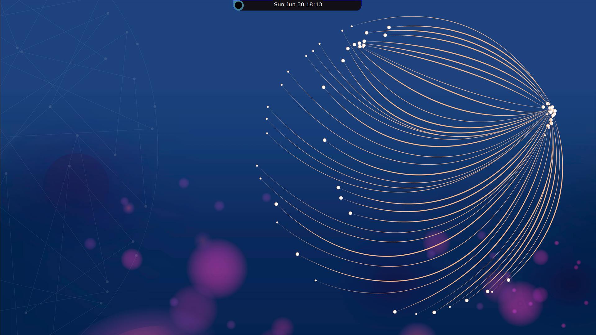
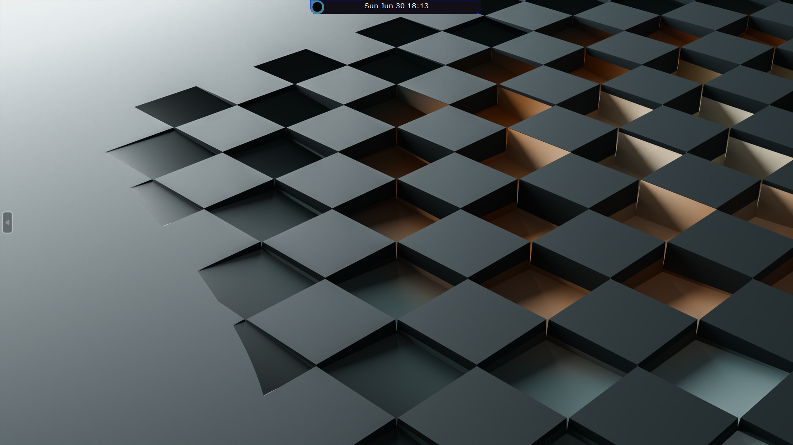

## Notcha

Desktop customization with a time notch 

**Features**

* [Circular] Hide button on the left 
* Show on hover
* Real Time Update
* Right in front of your eyes
* No need to move taskbar
* '' for Rainmeter Clock
* Background Process
* Less Power Consumption

**Installation**

To install notcha, you can follow these steps:

1. Clone the repository
2. Run `Notcha.exe` or `main.py`

**Examples:**

*Notcha in Action*

1:

2:

3:

4:

5:

**Contributing**

We welcome contributions to notcha! If you have any bug fixes, improvements, or new features, you can submit a pull request.

**License**

Notcha is licensed under the **CC BY-NC - 4.0
Creative Commons Attribution-NonCommercial 4.0 International** license. You can find the full license text in the LICENSE file.

